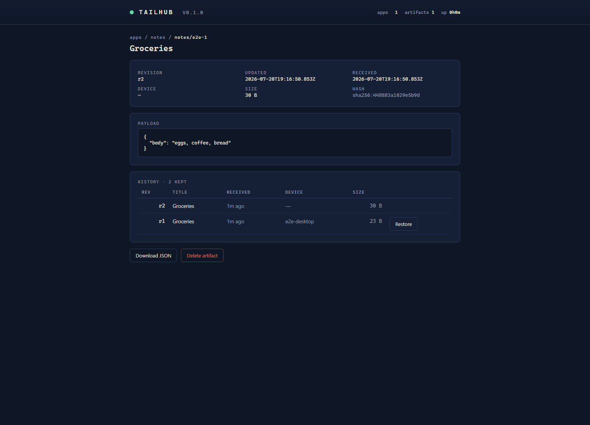
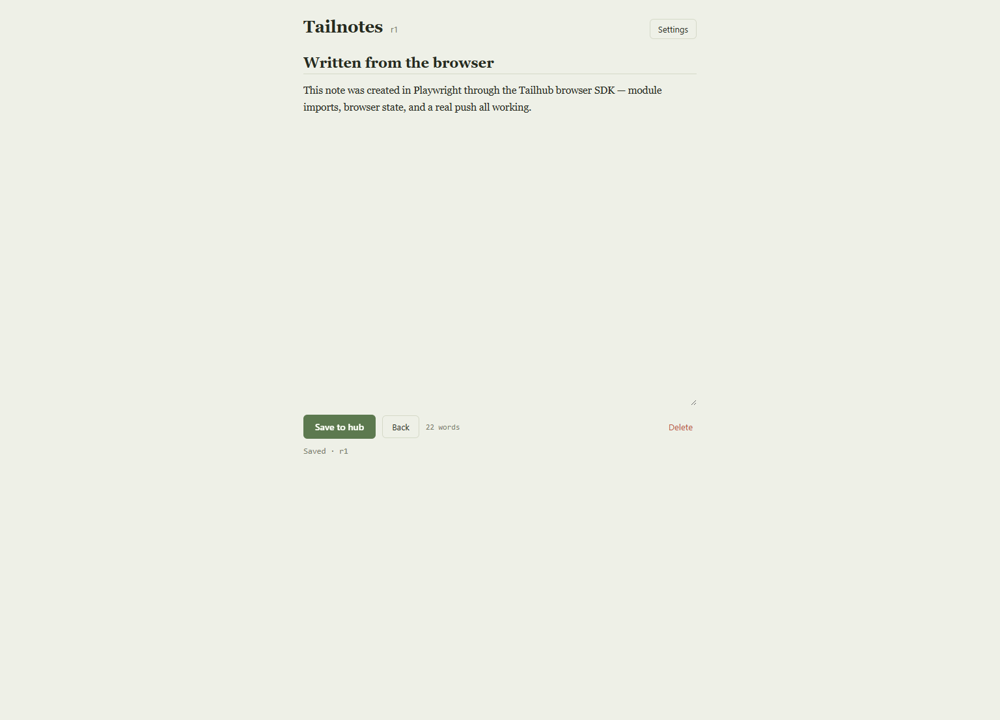

# Tailhub

[](https://github.com/alnandr/tailhub/actions/workflows/ci.yml)
[](https://www.npmjs.com/package/tailhub)
[](LICENSE)

**Private apps for your tailnet.** Tailhub turns any machine on your Tailscale
network into a backup and sync hub for local-first apps — apps whose data
lives on your devices, not in a vendor's cloud.

**New: [the Tailhub whitepaper](WHITEPAPER.md)** — why personal networks
need a data layer, the artifact model, and what a first-class "private apps"
platform could look like.

A "private app" is a PWA or native app that stores its data locally (IndexedDB,
SQLite, files) and syncs it to a **hub you own** over your tailnet: encrypted
transport by Tailscale (WireGuard), automatic HTTPS by Tailscale Serve, and
storage on your own disk. No accounts, no third-party servers, no telemetry.

Tailhub is the app-agnostic generalization of a sync hub originally built into
[Bottomline](docs/migrating-bottomline.md), a local-first personal-finance
PWA, where it has been daily-driven across desktop + phone. The portfolio-
specific parts were replaced by one concept: the **artifact**.

```
┌─────────────┐      ┌─────────────┐      ┌─────────────┐
│  phone PWA  │      │ laptop PWA  │      │ native app  │
│ (local data)│      │ (local data)│      │ (local data)│
└──────┬──────┘      └──────┬──────┘      └──────┬──────┘
       │    push / pull artifacts over the tailnet │
       └────────────────────┼──────────────────────┘
                            ▼
              https://desktop.your-tailnet.ts.net
              ┌─────────────────────────────────┐
              │          Tailhub hub            │
              │  artifacts · revisions · history│
              │  tombstones · app hosting · SDK │
              │        ~/.tailhub on disk       │
              └─────────────────────────────────┘
```

## The artifact model

Apps don't get raw storage — they register a **manifest** describing the data
they intend to keep, and the hub stores exactly that, as opaque revisioned
JSON payloads:

```json
{
  "app": "notes",
  "name": "Tailnotes",
  "collections": {
    "notes": { "maxBytes": 262144, "historyKeep": 10, "encryption": "optional" }
  },
  "www": true
}
```

Every artifact gets, for free:

- **Optimistic concurrency** — a push names the revision it built on
  (`baseRevision`); a stale push is refused with the winning revision's
  metadata so the app can merge or force. No last-write-wins data loss.
- **Revision history** — the hub retains the last N revisions per artifact for
  one-click restore (rollback is an insurance policy for sync bugs).
- **Tombstones** — deletions propagate between devices instead of deleted data
  resurrecting from a stale peer.
- **Attribution** — device name/id per revision, optionally the Tailscale
  identity when fronted by Tailscale Serve.
- **Optional end-to-end encryption** — the SDK seals payloads with a
  passphrase (PBKDF2 + AES-256-GCM); the hub stores ciphertext and a
  collection can *require* that.
- **Scoped tokens** — per-app bearer tokens (only SHA-256 digests stored on
  disk) so one app can never read another's data; one admin token for you.
- **App hosting** — the hub serves the PWA itself (`/apps/<app>/`) and the
  browser SDK (`/sdk/tailhub-client.js`), so a single `tailscale serve`
  command publishes app + data + console on one HTTPS origin.

The hub is a **zero-runtime-dependency** Node server (~1500 lines of
TypeScript): auditable in one sitting, installable anywhere Node 20+ runs.

## Quick start

**npm** (Node ≥ 20; first publish pending — tag `v0.1.0` ships it, see
[RELEASING.md](RELEASING.md)):

```bash
npm install -g tailhub    # or one-off: npx tailhub
tailhub start
#   tailhub v0.1.0
#   Listening: http://127.0.0.1:4747
#   Admin token (generated now, shown once — also saved to the token file): ...
```

**Docker** — including a Tailscale-sidecar compose file that keeps the hub
reachable only from your tailnet: see [docs/docker.md](docs/docker.md).

**From source**:

```bash
npm install && npm run build
node packages/hub/dist/cli.js start
```

Expose it to every device you own (once, with [Tailscale](https://tailscale.com)
installed and MagicDNS on):

```bash
tailscale serve --bg --https=443 http://127.0.0.1:4747
```

Open `https://<device>.<tailnet>.ts.net/` for the console, register an app,
and try the bundled example:

```bash
# register the example notes app + host its files (see examples/notes/README.md)
tailhub apptoken notes   # scoped token for your devices
```

**Run it at login**: `scripts/install-hub-startup.sh` installs a launchd
agent (macOS) or systemd user unit (Linux); on Windows,
`scripts/install-hub-startup.ps1` registers a Scheduled Task, with
`start-hub.ps1` / `setup-tailscale-https.ps1` handling background running
and HTTPS.

| Console | Example app (Tailnotes) |
|---|---|
|  |  |

## Building a private app

```js
import { TailhubClient, sealPayload } from '@tailhub/client'; // or /sdk/tailhub-client.js

const hub = new TailhubClient({
  baseUrl: 'https://desktop.tailnet.ts.net',
  app: 'notes',
  token: appToken,
  deviceName: 'alans-phone',
});

// create / update with conflict safety
await hub.push('notes', id, { payload: { body }, baseRevision: 0, title: 'Groceries' });

// cheap polling with ETags
const result = await hub.pull('notes', id, { etag: lastEtag });
if (!result.notModified) render(result.record);

// end-to-end encrypted (hub sees ciphertext only)
const sealed = await sealPayload({ body }, passphrase);
await hub.push('notes', id, { payload: sealed.payload, encryption: sealed.encryption, baseRevision: rev });
```

`@tailhub/client` is dependency-free and runs in browsers, Node ≥ 20, and
React Native. `@tailhub/client/browser` adds the localStorage plumbing a PWA
wants (settings, device identity, revision/etag tracking, pending queue, sync
health). `examples/notes` is a complete working app in one HTML file.

## Documentation

- [**The Tailhub whitepaper**](WHITEPAPER.md)
- [Artifact model & manifests](docs/artifacts.md)
- [HTTP API reference](docs/api.md)
- [Security model](docs/security.md)
- [Running in Docker](docs/docker.md)
- [Tailscale integration](docs/tailscale-integration.md)
- [Roadmap & sustainability](docs/roadmap.md)
- [Migrating Bottomline](docs/migrating-bottomline.md)

## Status & roadmap

v0.1 — extracted, generalized, and covered by an automated test suite
(conflict handling, tombstones, auth scoping, encryption policy, path
traversal; CI on Linux/macOS/Windows × Node 20/22), running the patterns
proven in Bottomline.

Planned next: change notifications (SSE) instead of polling · replaying
tombstones through bundle import · per-user access via Tailscale identity ·
`tsnet` embedding so the hub joins the tailnet as its own node · Swift/Kotlin
client kits — the full list lives in [docs/roadmap.md](docs/roadmap.md).

## Sustainability

Everything in this repository is MIT and **stays free forever** — features
never move behind a paywall. The project plans to sustain itself with a
future paid **Tailhub Pro** tier of team-oriented additions (roles/SSO on
Tailscale identity, audit log, quotas & metrics, multi-hub replication,
extended retention, priority support). The full pledge and the free/paid
line: [docs/roadmap.md](docs/roadmap.md).

Tailhub is an independent open-source project, not affiliated with or endorsed
by Tailscale Inc. — built in the hope that "private apps on your tailnet"
becomes a category. MIT licensed.
